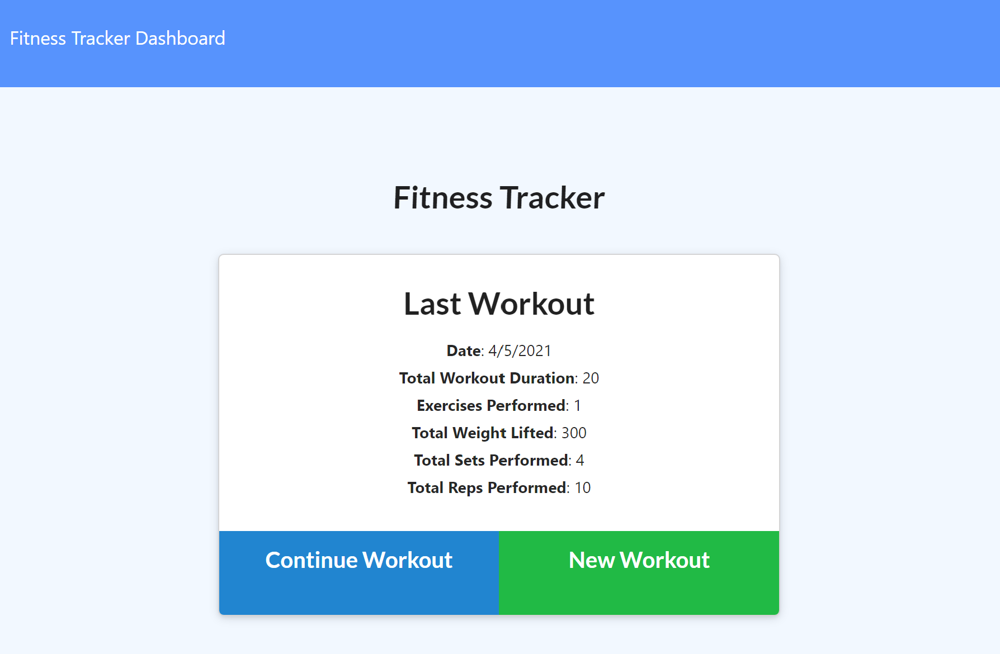
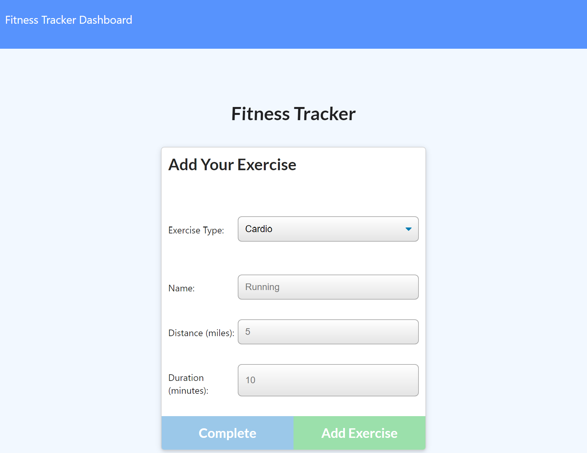
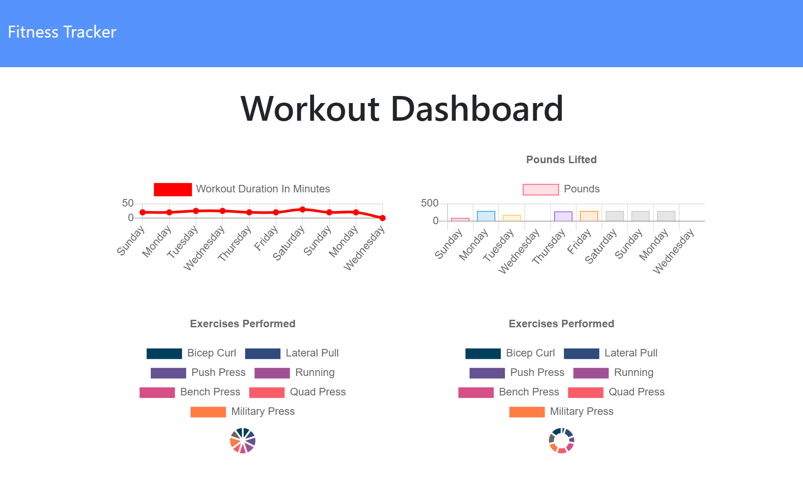

# Workout Tracker

## Description
    
This application is a workout tracker created with MongoDB, Node, & Express

## Table of Contents

* [Installation](#installation)
* [Usage](#usage)
* [Preview](#preview)
* [Deployed Application](#deployed-application)
* [Questions](#questions)

## Installation

#### Prerequisites

* [MongoDB](https://docs.mongodb.com/manual/installation/)
* [Node.js](https://nodejs.org/en/download/)

Download the project and run `npm i` in the directory to install the required npm packages.

## Usage

Run `node index.js` to start the application and visit `http://localhost:3000` in browser to view it.

When first starting out, you'll get the option to add a new workout. 

## Preview

## Deployed Application

A demo of this application is deployed live on Heroku

https://worker-tracker768.herokuapp.com/

## Questions

If you have any questions, you can reach me through my github or email below

Github: [LinosM](https://github.com/LinosM)

Email: [NguyenDuy768@gmail.com](mailto:NguyenDuy768@gmail.com)